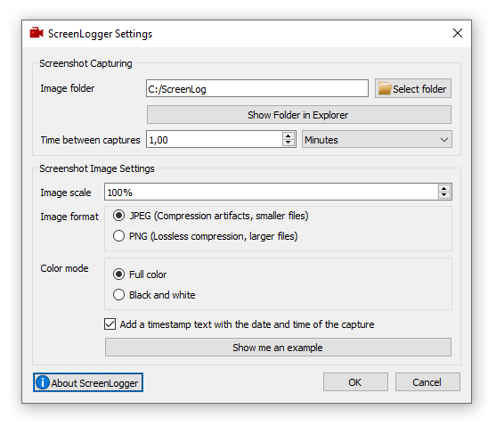
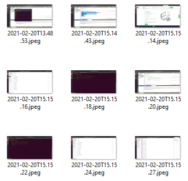

# ScreenLogger

Written and maintained by Lukas Boersma ([Contact](mailto:mail@lukas-boersma.com))

ScreenLogger is a tiny program that runs in the background and saves screenshots in timed intervals. It can be used to keep a log of what has happened on a computer. I use it as a fallback ground truth when I forget to write down how long I worked for clients.

ScreenLogger works on Windows and Linux. It might also work on macOS, but that is not tested.

If you find a bug, feel free to open an issue or send me a pull request.

 

## Building

ScreenLogger requires Qt v5.12 or newer to build. It has no other dependencies. On Ubuntu or other Debian-based Linux systems, you can install everything that is required by running `sudo apt install qt5-default`. On Windows and macOS, the easiest way is to install the [QtCreator IDE](https://www.qt.io/download-qt-installer).

If you have Qt and qmake installed and qmake is in your PATH, then you should be able to build it by executing `qmake` in the same directory as the . If you are unfamiliar with qmake, it might be easier to open the `ScreenLogger.pro` file with QtCreator and use the IDE to build it.

## License

ScreenLogger is free open source software, licensed under the [GNU General Public License (GPL) Version 3](License.md).